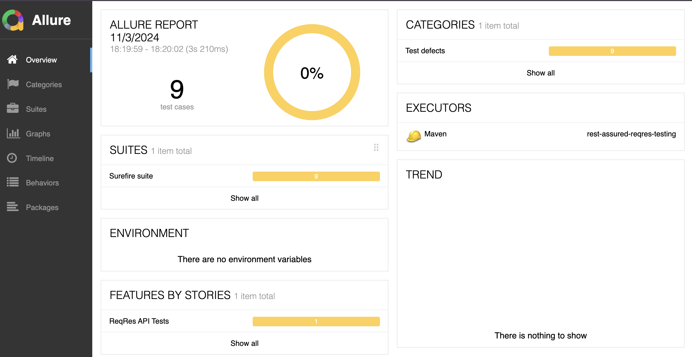
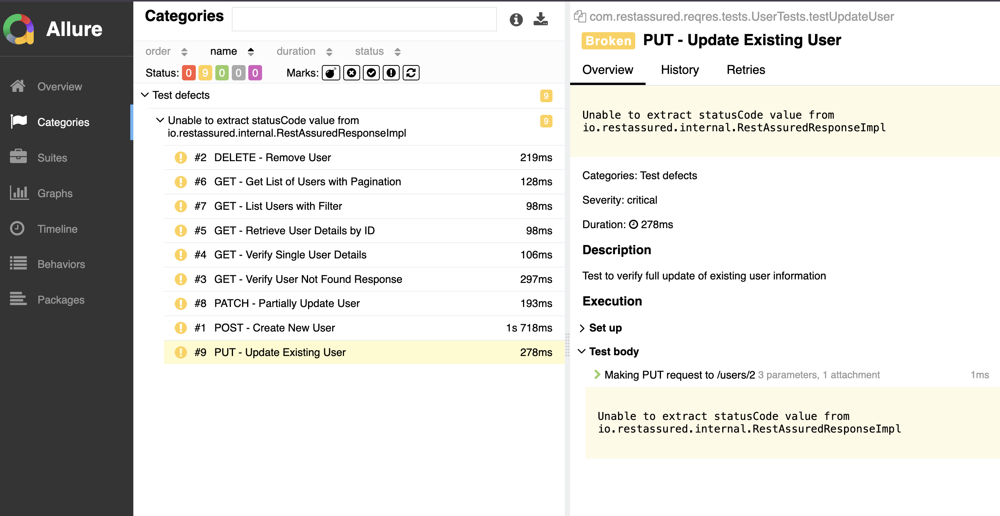
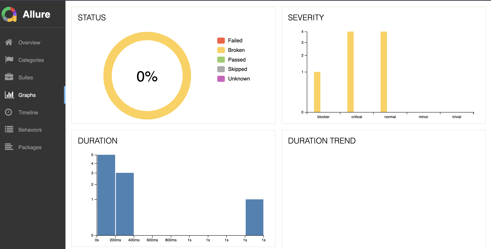

# REST Assured ReqRes API Testing Project


## Overview
...


This project demonstrates API testing using REST Assured framework with ReqRes API https://reqres.in/

<p align="center">
  
  
  
</p>

## Technologies Used
- Java 21
- REST Assured
- TestNG
- Log4j2
- Maven

## Test Cases
- User Management
- Get Single User
- Get List Users
- Get Non-existent User
- Create User
- Update User
- Partial Update User
- Delete User

## Project Structure
```plaintext
src
├── test
│   ├── java
│   │   └── com.restassured.reqres
│   │       ├── config
│   │       │   └── ConfigManager.java
│   │       ├── models
│   │       │   ├── User.java
│   │       │   ├── UserResponse.java
│   │       │   └── UsersListResponse.java
│   │       └── tests
│   │           ├── BaseTest.java
│   │           └── UserTests.java
│   └── resources
│       ├── config.properties
│       ├── log4j2.xml
│       └── testng.xml

```
## How to Run Tests and Reports
1. Clone the repository
2. Run tests using Maven:
```bash
mvn clean test
mvn allure:report
mvn allure:server
```